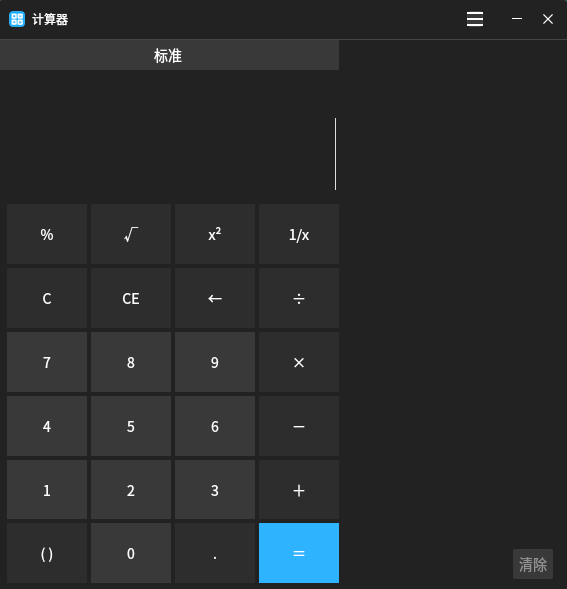

# 计算器

计算器一款快捷而简易的计算器，为用户提供加、减、乘、除等基本的数学计算。除了标准模式外，还提供了科学计算和程序员计算功能。

点击“开始菜单”>“计算器”启动工具，也可以在shell提示符下键入“kiran-calculator”启动计算器。

如下图所示：

切换计算模式：点击工具右上角更多图标，点击下拉框中的“标准、科学、程序员”可切换计算模式。

计算：使用鼠标键入或点击计算机中数字和运算符，键入回车或点击“=”可计算出结果。
