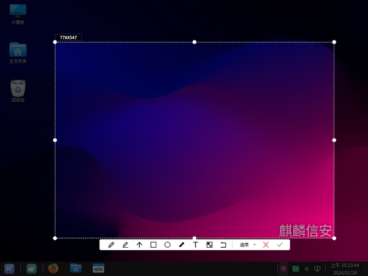
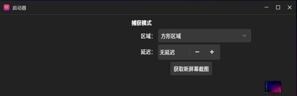
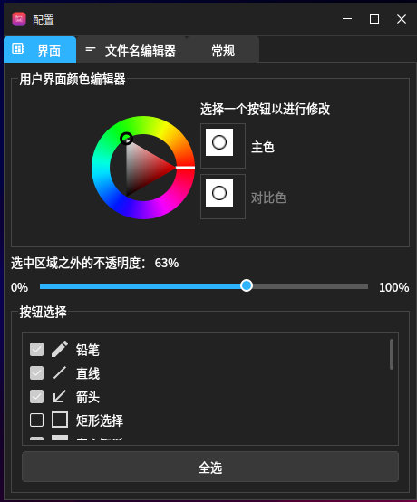
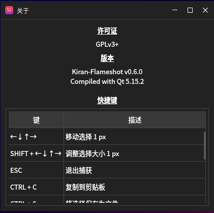
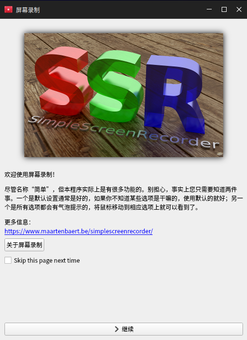
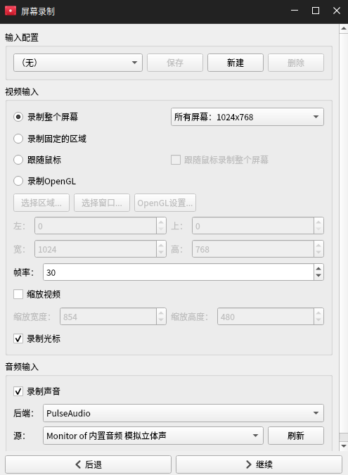
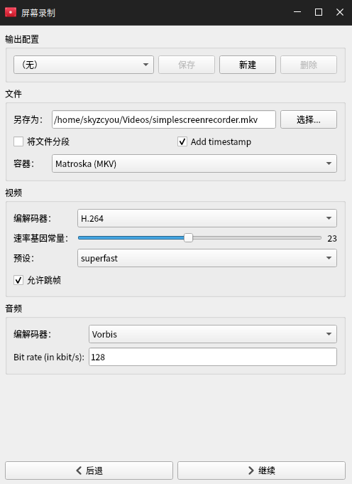
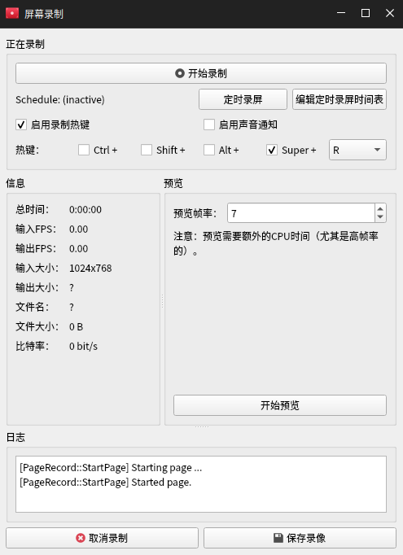

# 截图与录屏

## 截图工具
截图工具是一款对桌面截屏、编辑图片的工具，操作界面简洁，使用极为方便。

### 启动

点击“开始菜单”-》“截图工具”启动，工具图标显示在右下角托盘区域。

### 截图

鼠标左击右下角截图图标可进行截图，或者鼠标右击图标-》点击“进行截图”，弹出提示框，按Enter键截取当前屏幕并保存图片到桌面，按住鼠标左键拖动可自定义区域进行截图。

可以对截图进行编辑操作，点击图片下方的操作图标可以在图片上绘画、插入箭头、矩形、圆形、文字、马赛克。

点击“选项”弹出下拉框，可以选择存储的位置，如桌面、剪切板；可以选择保存的格式，如JPG、PNG、BMP。

点击“X”图标按钮取消截图，点击打勾图标保存截图。

启动器：鼠标右击右下角截图图标-》点击“打开启动器”启动

点击区域选择下拉框可选择“方形区域”或“全屏”，方形区域则自定义截图区域，全屏则截取整个屏幕；截图默认无延迟，点击“+”按钮增加截图延迟时间，点击“-”按钮减少截图延迟时间。点击“获取新屏幕截图”按钮进行截图。

### 配置文件

鼠标右击右下角截图图标-》点击“配置文件”打开

您可以设置截图界面、截图名称、常规设置。

### 信息

鼠标右击右下角截图图标-》点击“信息”打开关于窗口，可以查看截图工具的版本、快捷键。

### 退出

鼠标右击右下角截图图标-》点击“退出”即可退出截图工具。

## 屏幕录制

屏幕录制工具（SimpleScreenRecorder）是一款对桌面录屏的工具，操作界面简洁，使用极为方便。

### 启动
可从开始菜单中搜索找到该工具，然后启动：

点击继续则可进入录屏配置界面，如图所示：

