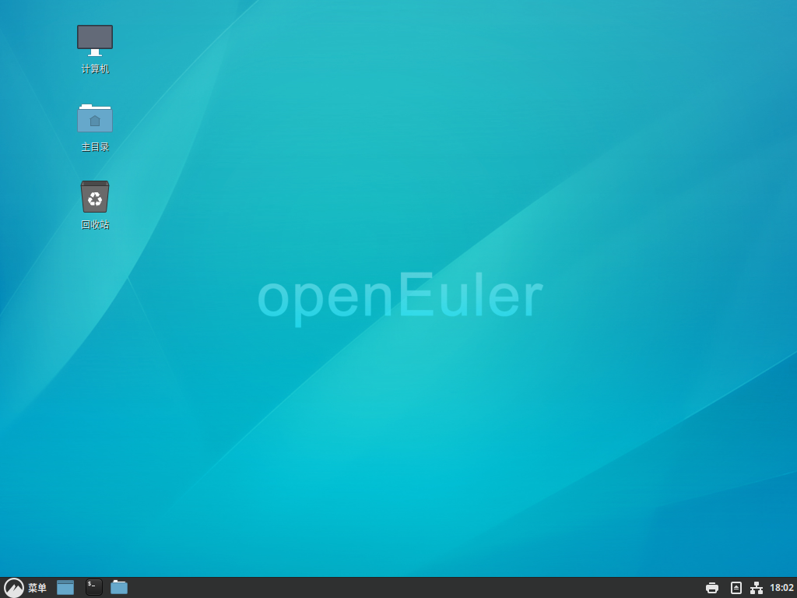

# KiranUI 用户指南

## 一、概述

Cinnamon是运行在类Unix操作系统中最常用桌面环境。其目标是基于自由软件，为Unix或者类Unix操作系统构造一个功能完善、操作简单以及界面友好的桌面环境，是GNU计划的正式桌面。

从用户的角度看，Cinnamon是一个集成桌面环境和应用程序的套件。从开发者的角度看，Cinnamon是一个应用程序开发框架(由数目众多的实用函数库组成)。即使用户不运行Cinnamon桌面环境，用Cinnamon编写的应用程序也可以正常运行。

Cinnamon既包含文件管理器，应用商店，文本编辑器等基础软件，也包含系统采样分析，系统日志，软件工程IDE，web浏览器，简洁虚拟机监视器，开发者文档浏览器等高级应用和工具。

Cinnamon提供了多个功能部件：

- cinnamon：Cinnamon桌面环境
- cinnamon-control-center ：Cinnamon控制中心
- cinnamon-desktop：Cinnamon桌面库
- cinnamon-menus：符合freedesktop保准的菜单布局库
- cinnamon-screensaver：Cinnamon锁屏及屏保工具
- cinnamon-session：Cinnamon Session
- cinnamon-settings-daemon：Cinnamon桌面全局配置管理
- cinnamon-translations：Cinnamon翻译集
- mint-themes：Cinnamon主题集合
- mintlocale：Cinnamon语言选择工具

本文主要描述Cinnamon的使用。

界面如下图所示。

 

## 二 、桌面

### 2.1 桌面

Cinnamon桌面比较简洁，默认只放了计算机、主目录、回收站三个目录链接。左下角为系统菜单，右下角为时间显示、消息通知等应用图标，下方中间为应用快速启动图标及打开的窗口列表。

### 2.2 右键菜单

在桌面空白处单击鼠标右键，出现的菜单如下图所示，为用户提供了一些快捷功能。

 

## 三、底部显示区

### 3.1 左下角菜单

菜单位于左下角，是Cinnamon桌面应用程序打开的重要途径。

#### 3.1.1 收藏夹和会话按钮

菜单左侧竖排为收藏夹和会话按钮。

上面三个为默认的收藏夹，分别是系统设置、终端及文件。

下面三个为默认的会话按钮，分别为锁定屏幕、注销及退出。

#### 3.1.2 搜索功能

菜单最上侧的输入框为搜索输入框，在此输入关键字，下方显示关键字在菜单中的搜索结果。

#### 3.1.3 应用分类显示

菜单中会显示系统中默认安装的所有具有桌面图标的应用，根据应用图标中的分类，在菜单中在不同的分类中显示。

其中左侧列显示的是系统中所有应用的分类，右侧显示该分类中的应用。

#### 3.1.4 菜单设置

在菜单上点击邮件，选择弹出菜单中的“配置...”选项

将会显示菜单的配置项，这里两个标签，分别对应设置菜单在面板上的显示，以及菜单中的设置。

### 3.2 右下角状态指示区域

显示当前系统状态指示，默认会显示打印机设置、挂载、网络、时间等，左键可以查看详情

右键配置相关组件

### 3.3 快速启动栏及窗口切换列表
快速启动按钮默认只有显示桌面、终端、文件三个按钮，本身具有窗口列表的功能，当打开其他应用的时候会自动在该列表中显示窗口列表。

## 四、系统设置

Cinnamon的所有设置都可以在“系统设置”中完成。可以通过“菜单”->“系统设置”打开。

依照Cinnamon安装手册安装桌面后，“系统设置”中所有设置一共分为四类：

 - 外观
 - 首选项
 - 硬件
 - 系统管理

### 4.1 外观

外观设置主要用来对Cinnamon桌面的视觉感官做设置，主要包括以下对桌面感官的设置：

 - 背景
 - 特效
 - 字体
 - 主题

#### 4.1.1 背景

在“外观”分类中点击“背景”，显示背景设置窗口

可以在左侧默认目录中选择不同的图片，也可以通过“+”添加其他的背景图所在目录。
在“设置”标签中设置图片的显示方式等。

#### 4.1.2 特效

在“外观”分类中点击“特效”，显示特效设置窗口

在这里可以设置桌面特效以及窗口特效。

#### 4.1.3 字体

在“外观”分类中点击“字体”，显示字体设置窗口

为Cinnamon桌面及带有GUI的程序设置字体的显示。

#### 4.1.4 主题

在“外观”分类中点击“主题”，显示主题设置窗口

主题设置窗口可以选择设置Cinnamon桌面环境中窗口、图标、控件、鼠标、桌面的显示主题。

在“添加/删除”标签页中可以从Cinnamon官网选择自己喜欢的的主题并下载到本地。

在“设置”标签页里设置微调主题。

### 4.2 首选项

首选项设置主要用来对Cinnamon桌面的功能做设置，用户可根据自己的喜好配置桌面环境，主要包括以下的功能设置：

 - 常规
 - 窗口
 - 窗口平铺
 - 辅助功能
 - 工作区
 - 开机自启动程序
 - 扩展
 - 面板
 - 屏幕保护程序
 - 热区
 - 日期和时间
 - 首选应用程序
 - 通知
 - 小程序
 - 隐私
 - 语言
 - 在线账户
 - 账户详情
 - 桌面
 - 桌面小工具

#### 4.2.1 常规

在“首选项”分类中点击“常规”，显示常规设置窗口

Cinnamon桌面常规设置，包括合成器选项、内存使用、检查刷新间隔等设置。

#### 4.2.2 窗口

在“首选项”分类中点击“窗口”，显示窗口设置界面

设置窗口布局、操作等行为设置。

#### 4.2.3 窗口平铺

在“首选项”分类中点击“窗口平铺”，显示窗口平铺设置窗口

设置平铺窗口设置选项。

#### 4.2.4 辅助功能

在“首选项”分类中点击“辅助功能”，显示辅助功能设置窗口

桌面环境中辅助功能设置，包括视觉、键盘、辅助输入、鼠标等辅助功能的设置。

#### 4.2.5 工作区

在“首选项”分类中点击“工作区”，显示工作区设置窗口

Cinnamon桌面工作区之间的显示、轮换的设置。

#### 4.2.6 开机自启动程序

在“首选项”分类中点击“开机自启动程序”，显示开机自启动程序设置窗口

设置登录Cinnamon桌面后要自动启动的程序。

最下按钮为“添加”、“编辑”、“删除”、“运行”。

#### 4.2.7 扩展

在“首选项”分类中点击“扩展”，显示扩展设置窗口

Cinnamon桌面扩展功能设置，可以通过“下载”页面从Cinnamon官方下载扩展功能。

#### 4.2.8 面板

在“首选项”分类中点击“面板”，显示面板设置窗口

设置Cinnamon桌面最下边的面板，打开设置窗口后，下方面板显示为高亮。可以设置下方面板的属性。

#### 4.2.9 屏幕保护程序

在“首选项”分类中点击“屏幕保护程序”，显示屏幕包换程序设置窗口

在“设置”标签页中设置屏保的触发时间。

在“自定义”标签页中设置屏保界面的显示设置。

#### 4.2.10 热区

在“首选项”分类中点击“热区”，显示热区设置窗口

设置桌面四个角鼠标移动过去的时候触发的操作。

#### 4.2.11 日期和时间

在“首选项”分类中点击“日期和时间”，显示日期和时间设置窗口

设置计算机的时区以及时间显示格式。

#### 4.2.12 首选应用程序

在“首选项”分类中点击“首选应用程序”，显示首选应用程序设置窗口

设置系统中文件默认打开使用的程序。

#### 4.2.13 通知

在“首选项”分类中点击“通知”，显示通知设置窗口

设置桌面消息通知的显示情况。

#### 4.2.14 小程序

在“首选项”分类中点击“小程序”，显示小程序设置窗口

系统默认自带的能添加到面板上的小程序。

可以通过“下载”页面从Cinnamon官方下载能添加到面板上的小程序。

#### 4.2.15 隐私

在“首选项”分类中点击“隐私”，显示隐私设置窗口

设置是否记录最近访问的文件。

#### 4.2.16 语言

在“首选项”分类中点击“语言”，显示语言设置窗口

设置Cinnamon桌面的显示语言及区域设置。

#### 4.2.17 在线账户

在“首选项”分类中点击“在线账户”，显示在线账户设置窗口

在系统中设置常见的网络账号。

#### 4.2.18 账户详情

在“首选项”分类中点击“账户详情”，显示账户详情设置窗口

显示当前用户的信息及密码设置。

#### 4.2.19 桌面

在“首选项”分类中点击“桌面”，显示桌面设置窗口

设置桌面的默认显示。

#### 4.2.20 桌面小工具

在“首选项”分类中点击“桌面小工具”，显示桌面小工具设置窗口

Cinnamon桌面默认自带能放在桌面的小工具。

可以在“下载”标签页中从Cinnamon官方下载能放在桌面的小工具。

可以在“一般设置”标签页中设置放在桌面的小工具的属性。

### 4.3 硬件

硬件设置主要用来对Cinnamon桌面外接的硬件做设置，用户可根据自己的喜好配硬件在Cinnamon置桌面中的属性，主要包括以下方面的设置：

 - 电源管理
 - 绘图板
 - 键盘
 - 色彩
 - 声音
 - 鼠标和触摸板
 - 网络
 - 系统信息
 - 显示

#### 4.3.1 电源管理

在“硬件”分类中点击“电源管理”，显示电源管理设置窗口

对屏幕显示及电源键做设置。

#### 4.3.2 绘图板

在“硬件”分类中点击“绘图板”，显示绘图板设置窗口

绘图板设置（暂时没有外设，无法展现）。

#### 4.3.3 键盘

在“硬件”分类中点击“键盘”，显示键盘设置窗口

可以在此设置键盘打字速度，键盘快捷键以及键盘布局。

#### 4.3.4 色彩

在“硬件”分类中点击“色彩”，显示色彩设置窗口

对不同的设备做颜色校准设置。

#### 4.3.5 声音

在“硬件”分类中点击“声音”，显示声音设置窗口

Cinnamon桌面声音设置，包括声音大小声音设备，以及正在使用声音设备的控制等设置。

#### 4.3.6 鼠标和触摸板

在“硬件”分类中点击“鼠标和触摸板”，显示鼠标和触摸板设置窗口

Cinnamon桌面中鼠标和触摸板的设置。

#### 4.3.7 网络

在“硬件”分类中点击“网络”，显示网络设置窗口

Cinnamon桌面中设置网络地址，以及系统中的代理的设置等。

#### 4.3.8 系统信息

在“硬件”分类中点击“系统信息”，显示系统信息设置窗口

显示当前系统的概要信息。

#### 4.3.9 显示

在“硬件”分类中点击“显示”，显示显示设置窗口

Cinnamon桌面分辨率设置。

### 4.4 系统管理

系统管理设置主要用来对Cinnamon桌面安全及用户做设置，主要包括以下方面的设置：

 - 防火墙
 - 用户和用户组

#### 4.4.1 防火墙

Cinnamon桌面中安全相关设置，包括服务的网络访问情况的设置等。

需要root权限用户才能做防火墙方面的设置。

#### 4.4.2 用户和用户组

在Cinnamon桌面中中创建、修改、删除系统中的用户和用户组。

需要root权限用户才能对系统中的用户和用户组做创建、修改、删除等操作。

 
