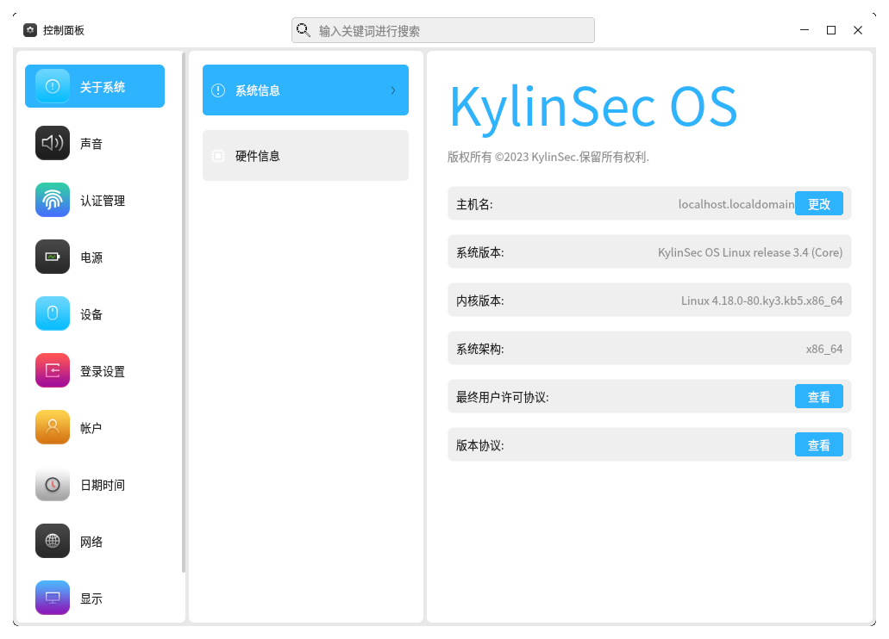

麒麟信安操作系统通过控制面板来对系统的基本设置进行管理，主要包含声音声音显示、电源设备、帐户网络等设置项目。
# 概述
控制面板中的设置项都被整合到连具体的分类中，打开控制面板程序之后可以看到其被分为连三列，第一列是一级分类，第二列是二级分类，第三列是具体的设置项。
# 关于系统
控制面板会默认打开关于系统的设置项，在此分类中，主要包含系统信息和软件信息，通过选中不同的二级分类便可查看并修改对应的信息。

# 声音设置
声音设置可以单独设置系统的输入、输出设备以及音量和左右的声道平衡。

# 认证管理

# 电源管理
# 设备管理
# 登录设置
# 帐户管理
# 日期时间
# 网络管理
# 显示管理
# 个性化设置