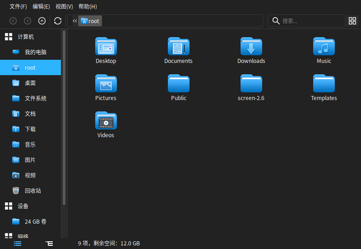
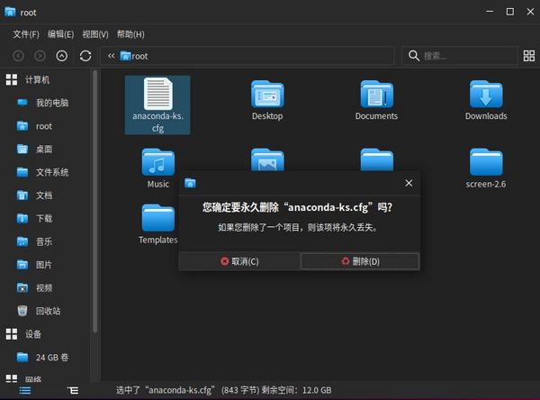
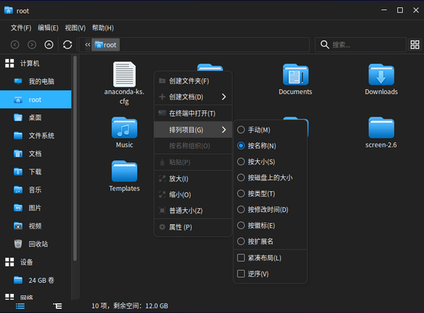
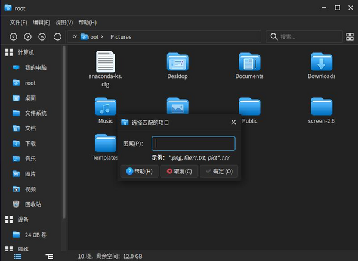
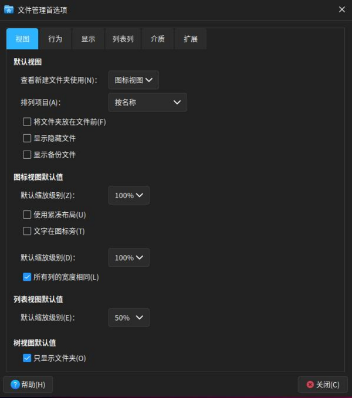
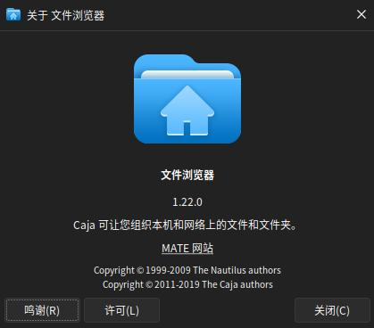

# 文件管理器
文件管理器是一款简单易用的文件管理工具，提供了方便而全面的方法来管理文件和应用程序，您可以使用它来完成以下操作：
1. 创建文件夹和文档
2. 显示文件和文件夹
3. 查找和管理文件
4. 运行脚本和快速启动应用程序
5. 定制文件和文件夹外观
6. 打开计算机中的制定位置
7. 把数据写入CD或DVD
8. 安装或删除字体

文件管理器左侧默认显示目录树位置，您可以点击位置区域在下拉框选择显示“信息、树、历史、备忘、徽标”；上方显示菜单栏，包括了”“；菜单栏下方显示操作图标，如“后退、前进、刷新、缩放、视图“等；中间显示当前位置下的文件和文件夹。
每个用户都有自己的主文件夹，包括了该用户的文件。用户桌面包含了用户主文件夹，可进行快速访问，以及回收站可以存放删除的文件和文件夹。

## 使用入门
### 启动
1. 双击桌面上的“计算机”图标或鼠标右键-》点击“打开”可以打开文件管理器；
2. 双击桌面上的“用户名的主文件夹”，如“root的主文件夹”图标，或者右键-》点击“打开”可以打开文件管理器
3. 点击任务栏上的文件管理器图标打开
4. 点击“开始菜单”-》主目录图标也可以打开

### 关闭
1. 点击“文件”-》“关闭”可以关闭文件管理器
2. 点击文件管理器右上角关闭按钮也可以关闭文件管理器

## 基本功能
### 创建文档
1. 鼠标右键文件管理器空白区域，点击“创建文档”-》“空文件”，可以成功创建一个新文件，输入文件名后回车则命名成功。
2. 点击菜单栏“文件”-》鼠标移至“创建文档”-》点击“空文件”也可以创建文档。
### 查看文档
1. 双击需要查看的文档可以打开文档进行查看，默认用文本编辑器打开；
2. 鼠标右键文档，点击“使用文本编辑器”打开进行查看。
### 复制粘贴文档
1. 复制：鼠标右键文档-》点击“复制”可以复制文档；或选中文档按下快捷键ctrl+c也可复制；
2. 粘贴：进入到需要粘贴的位置，鼠标右键空白区域，点击“粘贴”可以粘贴复制的文档；或按下快捷键ctrl+v也可粘贴。
### 永久删除文档
鼠标右键文档，点击“删除”按钮弹出是否永久删除的提示框，点击“删除”将会永久删除文档。

### 创建文件夹
1. 鼠标右键文件管理器空白区域，点击“创建文件夹”，可以成功创建一个未命名文件夹，输入文件夹名后回车则命名成功。
2. 点击菜单栏“文件”-》鼠标移至“创建文件夹”也可以创建文件夹。
### 复制粘贴文件夹
1. 复制：鼠标右键文件夹-》点击“复制”可以复制文件夹；或选中文件夹按下快捷键ctrl+c也可复制；
2. 粘贴：进入到需要粘贴的位置，鼠标右键空白区域，点击“粘贴”可以粘贴复制的文件夹；或按下快捷键ctrl+v也可粘贴。
### 永久删除文件夹
鼠标右键文件夹，点击“删除”按钮弹出是否永久删除的提示框，点击“删除”将会永久删除文件夹。
### 排列内容
鼠标右键空白区域，移动至“排列项目”，可以选择按照手动、名称、大小、磁盘大小、类型、修改时间、徽标、扩展名来进行排列，也可以设置紧凑布局和逆序。

### 回收站
移动到回收站：鼠标右键文档或文件夹，点击“移动到回收站”则文件被移动到回收站，需要在回收站中删除才可永久删除。

还原：打开回收站，选中需要还原的文档或文件夹，点击“还原选择的项目”，则选择的内容从回收站中移出，还原到之前存储的位置。
清空回收站：点击“清空回收站”按钮，则回收站中的内容都被永久删除，回收站置空。

## 菜单
### 文件
新建标签：在当前文件管理器打开一个新的标签页
新建窗口：新打开一个文件管理器窗口
连接到服务器：点击后弹出服务器连接详情输入框，输入服务器IP、端口，选择连接类型后点击“连接”

属性：点击后查看当前选择文件或文件夹的基本信息，如名称、类型、位置、文件卷、剩余空间等
在终端中打开：点击后打开终端，并打开当前位置
关闭全部窗口：点击当前文件管理器的窗口全部关闭
关闭：关闭当前标签页

### 编辑
撤消：取消上一次操作
重做：再次执行取消的上一次操作
复制：选中文件或文件夹，点击“复制”或按Ctrl+C进行复制
剪切：选中文件或文件夹，点击“剪切”或按Ctrl+X进行剪切
粘贴：选择要粘贴的位置，点击“粘贴”或Ctrl+V进行粘贴
全选：点击后选中当前位置下的所有文件和文件夹
选择匹配的项目：您可以使用一个或几个通配符来选择同一类文件，在弹出的输入框中输入需要搜索的类型，如*.jpg

反转选择：选中没有选择的文件或文件夹
就地复制：复制选中的选项到当前文件夹
创建链接：创建一个链接文件，链接到选中的文件
重命名：您可以重命名文件和文件夹
复制到：您可以复制选中的选项到主文件夹或桌面
移动到：您可以移动选中的选项到主文件夹或桌面
移动到回收站：将选中的内容移动到回收站
删除：点击后弹出永久删除提示框，点击“删除”按钮将永久删除内容
背景和徽标：可以设置文件管理器的背景和徽标
首选项：文件浏览器的默认设置，您可以修改视图、行为、显示、列表列、预览、介质、扩展设置

### 视图
您可以设置文件管理器是否显示工具栏、侧边栏、位置栏和状态栏，默认是全部勾选显示，还可以勾选显示附加窗格。
将视图重置为默认值：点击后将重置视图设置，回到初始设置状态
显示隐藏文件：勾选后显示隐藏文件
显示备份文件：勾选后显示备份文件
缩放：点击“放大”将放大文件或文件夹的显示大小；点击”缩小“将缩小显示大小；点击”普通大小“则显示默认的正常大小。
显示格式：您可以选择图标、列表或紧凑视图。

### 转到
转到用于切换位置，可以切换到主文件夹、计算机、回收站、文档、下载、/等目录，也可以切换到其他目录，点击“后退”返回到上一个位置，点击“前进”则回到后退前的位置。
### 书签
添加书签：点击后将当前位置添加书签，在左侧书签栏显示，点击后快速跳转到改位置
编辑书签：选中需要编辑的书签，可以修改名称、位置，也可以移除

### 帮助
目录：点击“目录”或按下F1打开帮助手册，查看帮助信息
关于：点击后显示文件管理器的关于信息，如版本、许可等。
