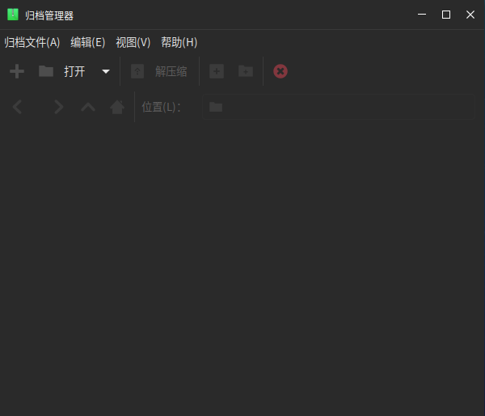

# 文件压缩解压工具

归档管理器是一款界面友好、使用方便的压缩与解压缩软件，支持 7z、jar、tar、tar.bz2、tar.gz、tar.lz、tar.lzm、tar.lzo、tar.Z、zip 等多种压缩包格式。

点击“开始菜单”>“Engrampa归档管理器”可以启动归档管理器，如下图所示：

创建归档文件：点击“+”按钮新建归档文件，输入名称，选择路径后点击“创建”。

打开归档文件：点击“打开”后选择文件可打开。

解压缩：选中归档文件点击“解压缩”>选择解压目录>“解压缩”。