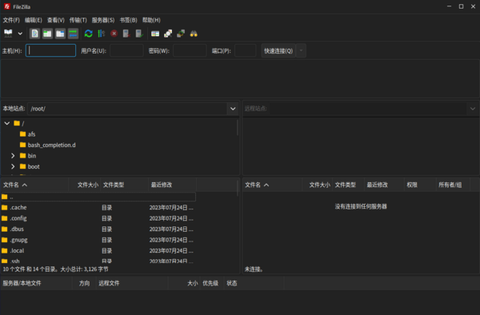

# FileZilla
FileZilla是一个免费开源的软件，分为客户端版本和服务器版本，具备所有的FTP软件功能。

可控性、有条理的界面和管理多站点的简化方式使得Filezilla客户端版成为一个方便高效的FTP客户端工具，而FileZilla Server则是一个小巧并且可靠的支持FTP&SFTP的FTP服务器软件。

点击“开始菜单”>“FileZilla”启动客户端工具，如下图所示：

连接服务器：输入服务器主机IP、用户名、密码和端口号（FTP默认值21，SFTP默认值22），点击“快速连接”即可。

客户端上传数据到服务器：在本地窗格选择要上传的文件，鼠标右键>点击“上传”。

服务器数据下载到本地：在服务器窗格选择要下载的文件，鼠标右键>点击“下载”。
