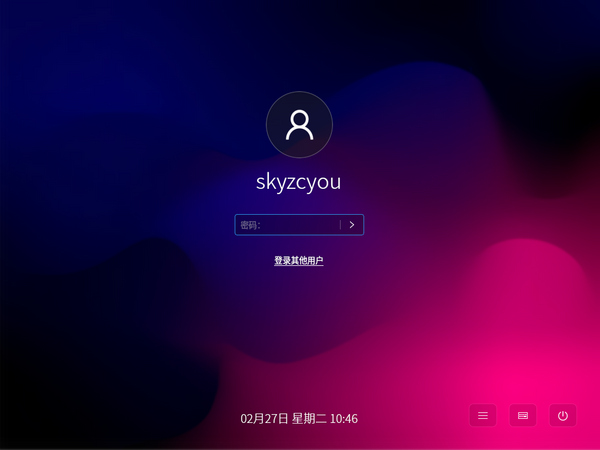
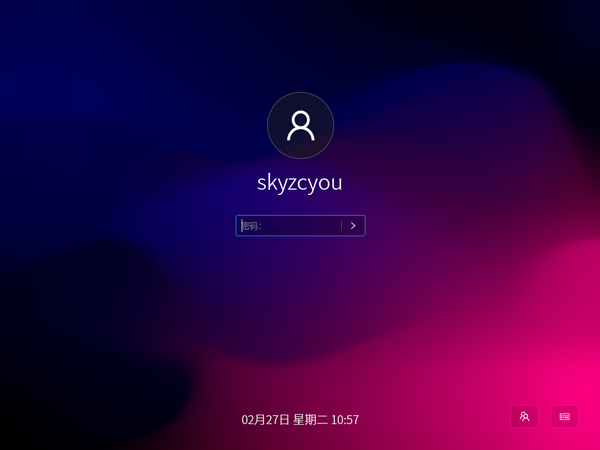

# 登录锁屏

## 登录

桌面登录界面如下：

### 用户登录
首次登录时，会自动选中默认用户，只需要输入该用户密码即可正常登录系统。

也可以选择　`登录其他用户`　来输入对应的帐户名称和密码进行登录。

### 登录菜单

在登录界面右下角包含了三个功能菜单，如图所示：

从左自右分别是：

- 会话菜单: 提供会话切换功能，目前只提供了`kiran`会话选项。
- 虚拟键盘: 调起虚拟键盘来提供输入功能　会根据　`onboard` 安装情况来显示隐藏。
- 电源菜单: 提供常用电源选项，包括休眠、待机、重启、关机。

## 锁屏

桌面锁屏界面如下：

### 用户解锁

锁屏界面与登录界面类似。用户解锁需要在屏幕中心的输入框中输入当前用户的密码，校验正确后才可解锁屏幕。

### 锁屏菜单

在锁屏界面右下角包含了两个功能菜单，如图所示：

从左自右分别是：

- 切换用户: 提供用户切换功能，点击可以切换到登录界面，用于登录其他用户。
- 虚拟键盘: 调起虚拟键盘来提供输入功能　会根据　`onboard` 安装情况来显示隐藏。