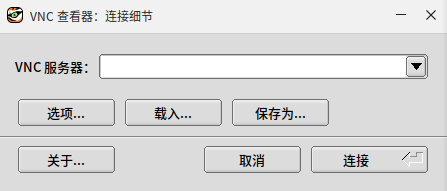
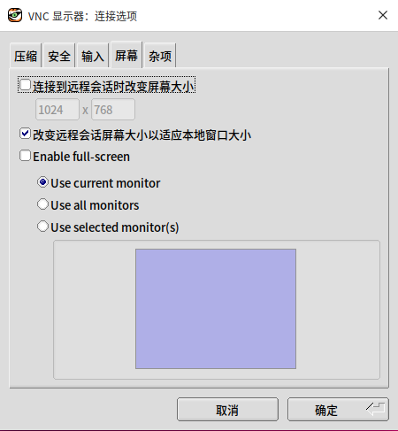

# VNC客户端

桌面环境中提供 `TigerVNC` 作为远程桌面客户端，可以在开始菜单中搜索　`TigerVNC`　或者 `VNC远程桌面客户端`。

## 基本使用

VNC远程桌面客户端启动后如下图所示：

在`VNC服务器`　中输入目标机器的　IP 地址后即可进行链接（需要确保目标机器安装并启动了　VNC　服务）。
　
## 配置选项

在 `TigerVNC` 首页中，可以选择`选项`按钮，打开详细的连接配置选项，对连接进行高级配置。

